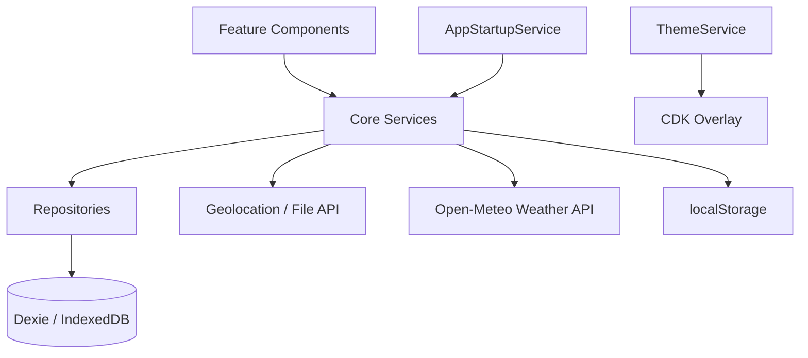

# Architecture

## Overview

FishTracker is an Angular 21 standalone-component PWA with an offline-first data layer.

## Layers

### Presentation (`src/app/features/`, `src/app/layout/`, `src/app/shared/`)

- **Features**: dashboard, sessions, active-session, catches, lakes, gallery, statistics, settings, profile, PIN screens.
- **Layout**: shell with bottom navigation.
- **Shared**: session-card, filter-panel, expandable-section, weather-card, dialogs.

### Core services (`src/app/core/services/`)

| Service | Role |
|---------|------|
| `AppStartupService` | DB init, startup navigation, return URL |
| `PinLockService` | PIN hash, lock state, inactivity |
| `SessionService` | Session CRUD, start/complete/edit |
| `CatchService` | Catch CRUD, session stats update |
| `LakeService` | Lake and spot management |
| `ImageService` | Compression, thumbnails, cover images |
| `WeatherService` | Live and cached weather |
| `ThemeService` | Dark/light/system theme, overlay sync |
| `DialogService` | Theme-aware Material dialogs |
| `SettingsService` | App settings in localStorage |
| `BackupService` | JSON export/import |
| `FilterService` | Session/catch filters and presets |

### Repositories

Thin Dexie wrappers: `SessionRepository`, `CatchRepository`, `LakeRepository`, `ImageRepository`, `ProfileRepository`.

Components must not access `db` directly.

### State management

- **Signals**: component-local UI state, theme resolution.
- **RxJS + liveQuery**: reactive lists (sessions, catches).
- **toSignal**: bridge observables to templates in zoneless mode.

### PWA

Service worker registered in production via `@angular/service-worker`. Offline data remains available through IndexedDB.

## Key files

- Bootstrap: `src/main.ts`, `src/app/app.config.ts`
- Root: `src/app/app.ts` (startup splash gate)
- Database: `src/app/core/db/fish-db.ts`
- Routes: `src/app/app.routes.ts`
