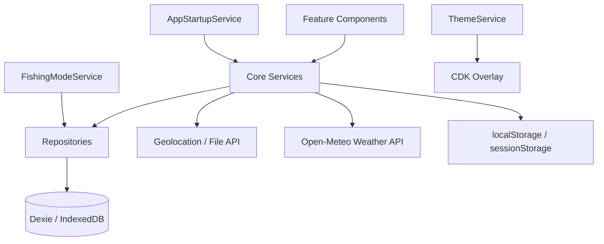

# Architecture

## Overview

FishTracker is an Angular 21 standalone-component PWA with an offline-first data layer. Production builds are **static** (`outputMode: static`) for GitHub Pages — there is no SSR/Express server.

Fishing data is partitioned by **fishing mode** selected once per app run after PIN unlock.

## Layers

### Presentation (`src/app/features/`, `src/app/layout/`, `src/app/shared/`)

- **Features**: dashboard, sessions, active-session, catches, lakes, gallery, statistics, settings, profile, PIN screens, mode-select.
- **Layout**: shell with bottom navigation, mode banner, and dismissible offline banner.
- **Shared**: session-card, filter-panel, expandable-section, weather-card, dialogs.

### Core services (`src/app/core/services/`)

| Service | Role |
|---------|------|
| `AppStartupService` | DB init, startup navigation, return URL |
| `FishingModeService` | Mode selection for this app run; `modePreferences` helpers |
| `PinLockService` | PIN hash, lock state, inactivity, attempt lockout |
| `SecretVaultService` | PIN-wrapped AI API key (memory while unlocked) |
| `SessionService` | Session CRUD, start/complete/edit (mode-scoped) |
| `CatchService` | Catch CRUD, session stats update |
| `LakeService` | Lake and spot management |
| `ImageService` | Compression, thumbnails, cover images, homepage (mode-scoped) |
| `WeatherService` | Live and multi-slot cached weather |
| `SessionWeatherMonitorService` | Polls weather for the active session |
| `ConnectivityService` | Online/offline signal for shell banner and network-aware services |
| `ThemeService` | Dark/light/system theme, overlay sync |
| `DialogService` | Theme-aware Material dialogs |
| `SettingsService` | App settings in localStorage |
| `BackupService` | JSON export/import (all modes) |
| `ResetService` | Settings reset, current-mode reset, full wipe |
| `FilterService` | Session/catch filters and per-mode presets |
| `UserOptionService` | Species/bait/rig options (mode-scoped) |
| `ChatService` | Ask-your-data threads (mode-scoped) |

### Repositories

Thin Dexie wrappers extending `ModeScopedRepository`: filter reads by active mode, stamp `fishingMode` on write, hide cross-mode `getById`. Backup uses `getAllAcrossModes()` / import with explicit `fishingMode`.

Components must not access `db` directly.

### State management

- **Signals**: component-local UI state, theme resolution, selected fishing mode.
- **RxJS + liveQuery**: reactive lists (sessions, catches) filtered by mode.
- **toSignal**: bridge observables to templates in zoneless mode.

### PWA

Service worker registered in the **production** (GitHub Pages) build via `@angular/service-worker`. Self-hosted fonts under `/media/` are in a **prefetch** asset group so Material Icons load on installed PWAs. The **android** (Capacitor) build does **not** register a service worker — assets ship in the APK. Offline data remains available through IndexedDB. Optional network features (weather, geocoding, maps, AI) degrade via `ConnectivityService`, local caches, and snackbars.

## Key files

- Bootstrap: `src/main.ts`, `src/app/app.config.ts`
- Root: `src/app/app.ts` (startup splash gate)
- Database: `src/app/core/db/fish-db.ts`
- Routes: `src/app/app.routes.ts`
- Mode model: `src/app/core/models/fishing-mode.model.ts`
- Storage keys: `src/app/core/constants/storage-keys.ts`
